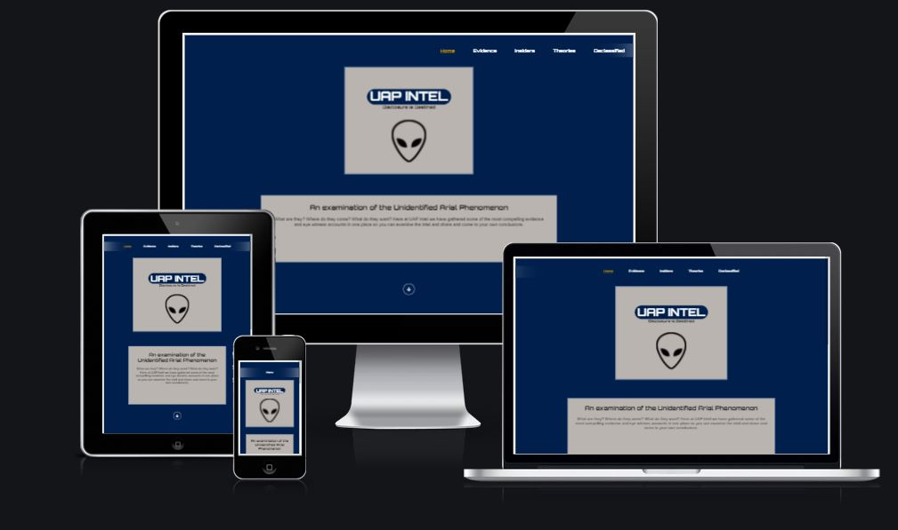

UAP Intel
In this section, you will include one or two paragraphs providing an overview of your project. Essentially, this part is your sales pitch. At this stage, you should have a name for your project so use it! Don’t introduce the project as a Portfolio project for the diploma. In this section, describe what the project hopes to accomplish, who it is intended to target and how it will be useful to the target audience.

This website was created for UAP or UFO enthusiasts. The idea beind this project is to collate UAP related content in the in all its forms in one place and tried to keep the content limit to credible accounts of UAP encounters. The content is breif and bite sized to allow the user to rapidly gain insight into the subject of UAPs but also caters for those looking for lenghtheir documentation by providing links to official reports.
With so many dubious information online relating to UAPs, this website is intended to present only credible content so that the website will be a trusted source for information. 

Also, given the renewed interest in the subject of UAPs, this product has been developed at the right time and the hope is as the interest grows and more information is declassified, this site will be already somewhat established and hopefully become one of the more popular UAP websites.

Features
In this section, you should go over the different parts of your project, and describe each in a sentence or so. You will need to explain what value each of the features provides for the user, focusing on who this website is for, what it is that they want to achieve and how your project is the best way to help them achieve these things.

Existing Features
Navigation Bar

The navigation bar is used on all pages, however, when the site is viewed on mobile screens, the navigation format changes to a single menu button which displays a drop down menu when tapped. The drop down menu is more user friendly on smaller screens. On the home page, there is the traditional navigation on the top right of the screen and a series of images that function as links to the four content pages. At the bottom of all pages is a button that links to the sign up page followed by a footer containing social media links. The page logo also provides a link to the home page for intuitive navigation. There is a link in the center of the screen to indicate to the user that there is more content below.

UAP Intel

This section introduces the user to UAP Intel with an image of an extra-terrestrial centrally with the UAP logo directly above with an introduction paragraphy breifly describing what intent of the website.

Image links section

The image links section will allow the user to see user to see visual representations of the various pages available. Each image represents a different topic and provides a more interesting intuitive way for the user to navigate.

The Footer

The footer section contians links to social media to allow the user to consume content in a variety of formats which they may prefer to use. Each links opens in a seperate tab which allows user to keep the UAP Intel page open so that they can easily revert back to the UAP Intel site. Soical media allows the user to recieve content and updates and keeps them engaged with the site.

Evidence

Most UAP entusiasts are looking for proof of their existence in the form of videos or photographs, hence the first link made available to the user is the evidence page where the most recently released or declassified UAP videos can be found, allowing the user to dive right in.

Insiders

Insiders page is offered up next, providing the user with some of the most credible and fascinating sources of imformation on the UAP subject. The purpose of this page is to introduce the user to icons of the UAP subject, pointing the user in the right direction to find information from credible sources.

Theories

This page contains an article that attempst to lay out the main theories that try to explain where UAPs might come from, why they are here and what they want.

 Declassifed

 This page provides links to official reports from various governments. The number of links will grow to iclude all public available information on UAPs provided by Governments across the globe.

Features Left to Implement

In the future I would like to add a comment section that invites users to post there own experinces sightings or encounters with UAP and post any images of videos they may have as well as catalogue locations which would populate a world wide map so users can see exactly where sightings occur. A more sophisticated drop down menu and overall more stylised appearance will be developed over time. A photo gallery will also make a good addition to teh evidence page. More content will be added to teh "theories" page and individual pages for more in depth biographies for the "insiders".

Testing
In this section, you need to convince the assessor that you have conducted enough testing to legitimately believe that the site works well. Essentially, in this part you will want to go over all of your project’s features and ensure that they all work as intended, with the project providing an easy and straightforward way for the users to achieve their goals.
All links tested and functioning. All links change color on mouse over and all elements on each page have been tested for responsiveness. The elements arange themselves without breaking all the way down to screen sizes of at least 320px wide.

The image links on the landing page increase in size and decrease in brightness and text highlights in yellow to clearly indicate that the link is functional and invites interaction. The images are used to draw the users attention. And the text under each image gives a brief description of what content awaits. The links are of sufficient size to be user freindly and not "fiddly". The navigation bar is sutble but clearly visible and provides a traditional form of navigation.

The Evidence page is simple in appears to work well. the user simply scrolls down to access video content. Likewise the Insiders page is simple in appearance with content arranged vertically, very easy to navigate and providing users with bite sized snioppets of information.

The theories page provides an article that quickly introduces the user to theories that try to answer the most basic questions regarding UAPs. The user gets quick access to conscice information.

The sign up page changes the colour pallet to provide a little variety and off users an opportunity to sign up for a news letter.

All links tested and confirmed working. Chrome develpoer tools was used to ensure the sites pages looked good on various screen sizes all teh way down to 320px wide. Numerous adjustments were made and checked repeatedly. On full size screens the landing pages content assumes and landscape orientation spread from left to right acoss the page. As the screen size gets smaller, teh page elements begin to assume a sqaure or verical layout so that all teh content can fit on screen and finally on smart phone screen sizes, the content becomes even more vertically oreinted with little or no side margins and the navigation menu becomes simpliflied.

In addition, you should mention in this section how your project looks and works on different browsers and screen sizes.

You should also mention in this section any interesting bugs or problems you discovered during your testing, even if you haven't addressed them yet.

If this section grows too long, you may want to split it off into a separate file and link to it from here.

Validator Testing
HTML
No errors were detected when all HTML code was tested usign the official W3C validator.
CSS
No errors were detected when all HTML code was tested usign the official Jigsaw validator.
Unfixed Bugs
There are no unfixed bugs, luckily there were very few bugs encountered throught develpoement of this site.

Deployment
[This section should describe the process you went through to deploy the project to a hosting platform (e.g. GitHub)]

[The site was deployed to GitHub pages. The steps to deploy are as follows:
In the GitHub repository, navigate to the Settings tab
From the source section drop-down menu, select the Master Branch
Once the master branch has been selected, the page will be automatically refreshed with a detailed ribbon display to indicate the successful deployment.
The live link can be found here - https://code-institute-org.github.io/love-running-2.0/index.html]

Credits
[In this section you need to reference where you got your content, media and extra help from. It is common practice to use code from other repositories and tutorials, however, it is important to be very specific about these sources to avoid plagiarism.

You can break the credits section up into Content and Media, depending on what you have included in your project.]

Content

I used code from this youtube video >"https://www.youtube.com/watch?v=9YffrCViTVk*/. The credit for htis video goes to tipswithpunch. The code allowed me to make teh embedded youtube videos I used responsive.

The background images I used come from pixabay. The landign pages image is from here >[insert link]
teh form page image is from here [insert link]

Below is a list of images I used and where to find them:

Bob Lazar image which can be found here
Luis Elizondo image which can be found here
David Fravor image which can be found here
Travis Walton ikage which can be found here

Research on the above individuals was done on wikipedia.com and the historychannel.com, youtube videos too.

The social media links are from Fontawesome.

The content from the "Theroies" page come from a variety of sources over the years, youtube mostly.

[The text for the Home page was taken from Wikipedia Article A
Instructions on how to implement form validation on the Sign Up page was taken from Specific YouTube Tutorial
The icons in the footer were taken from Font Awesome]
Media
The photos used on the home and sign up page are from This Open Source site
The images used for the gallery page were taken from this other open source site

 Use a colour pallet to hhelp decide which colours to use. Coolor is a fantastic site that can present colour pallets from a photogrpah that you upload. I found this to be an amazing tool as I was having difficulty in chosign colors that work well together. 

Allowing suffientc t=ime for your project is eesential as it is very easy to over estimate how much work you will complete in a any gievn time frame as bugs or other unexpected circuumstances can delay you leading to an insane amount of "crunch" towards the end as your deadline approaceh.

Scope your project cuatiously also , as again its easy top ovrestimate how much work can be compoeted in a given timeframe.

Keep your codign tidy from teh beginign an dsas you go alonm gas iot will make readign and navigating your cown code much easier and save havngit to tidy the code at the. Chose id and class names carefuilly as I pften found mysefl changign teh m later to be a better description adn tis meant having to check carefully that all rules targingt eh ids and classes were also changed accordignly. Lesson learned is to chose the name carefully from teh outsse t , so you dont have to chnage it again.

Remain calm. When you get stuck and some code is not working as you expect, stay calm as getting frustrated makes it harder to find teh fix. If you get really stuck, take a break clear your head, and sometimes the solution will just piop into your head or even pop into you head after sleeping on it. If all else fails, gogle is your firend, but again, searching for answerrs is much harder when angry or frustrated, take you time and stay calm.

