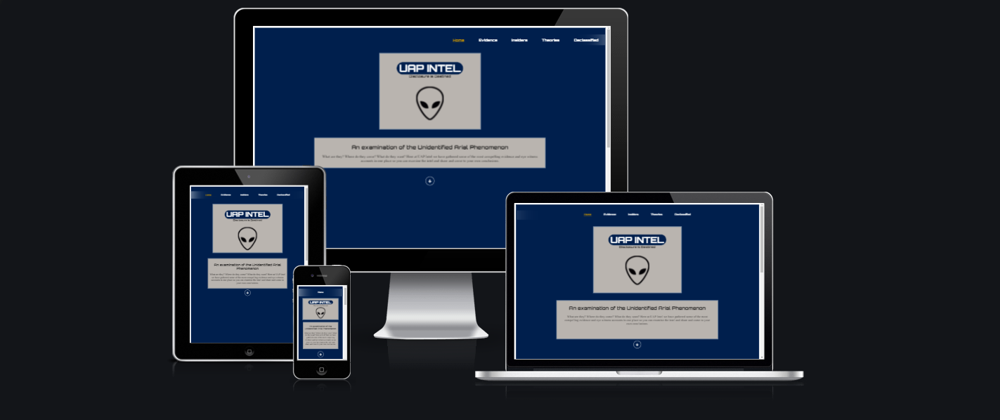
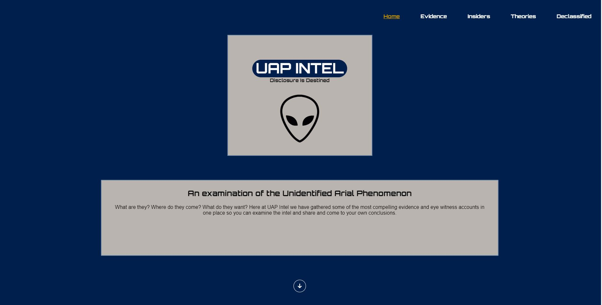
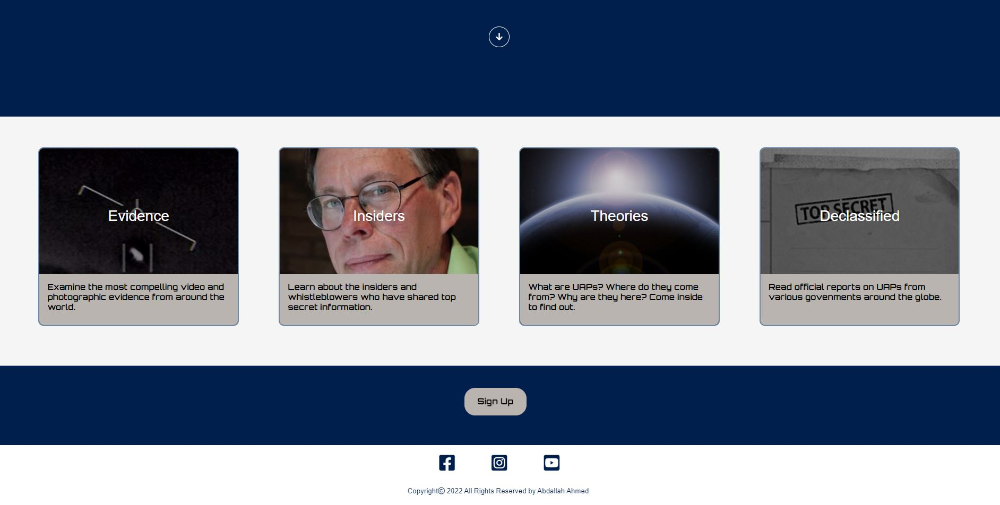
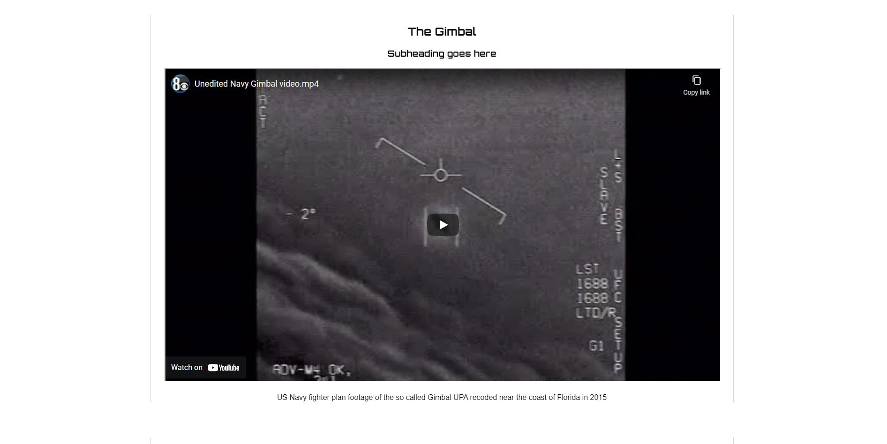
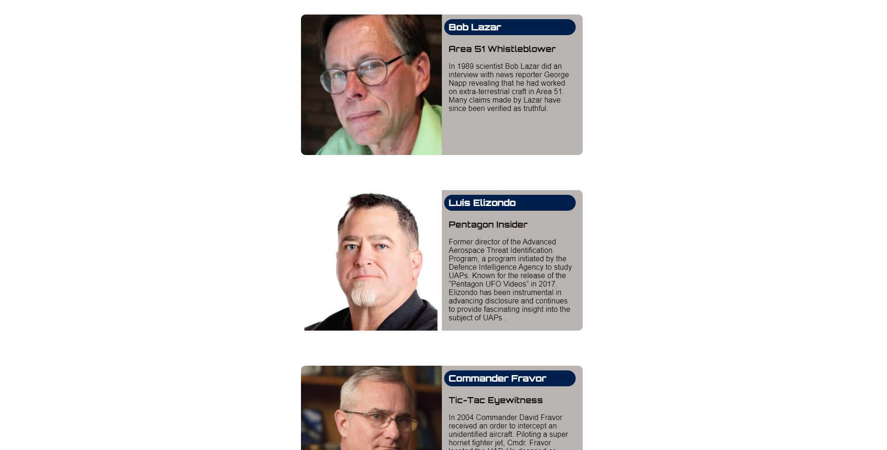
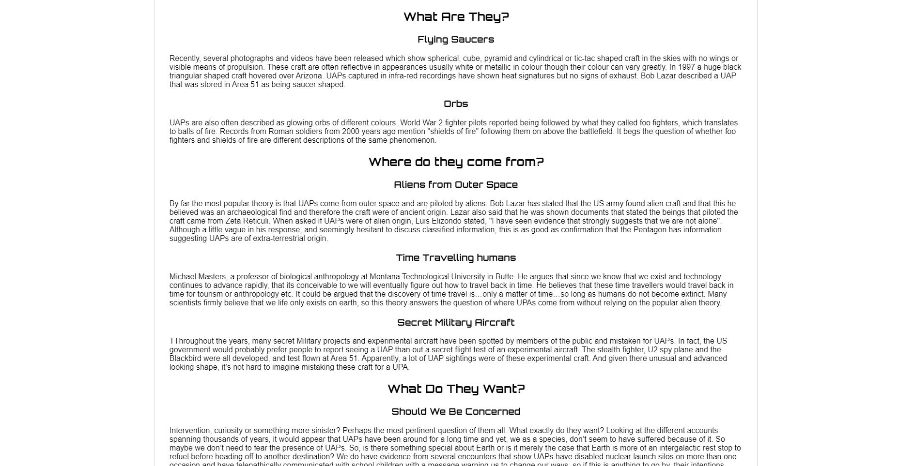
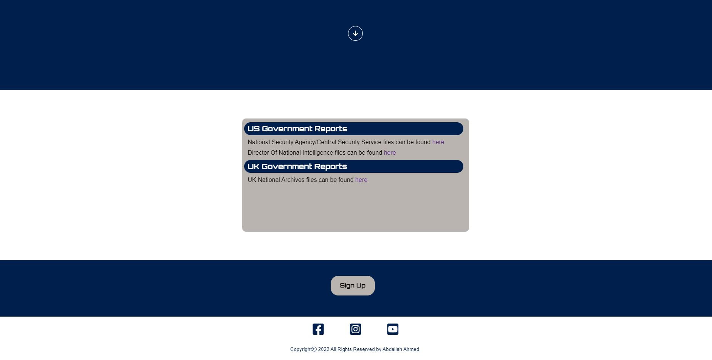
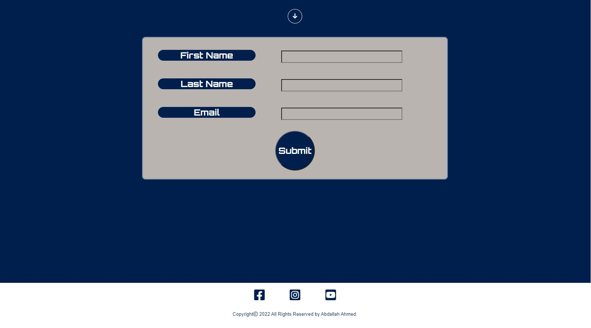

# UAP Intel:

This website was created for UAP or UFO enthusiasts. The idea beind this project is to collate UAP related content in the in all its forms in one place and tried to keep the content limit to credible accounts of UAP encounters. The content is breif and bite sized to allow the user to rapidly gain insight into the subject of UAPs but also caters for those looking for lenghtheir documentation by providing links to official reports.
With so many dubious information online relating to UAPs, this website is intended to present only credible content so that the website will be a trusted source for information. 

Also, given the renewed interest in the subject of UAPs, this product has been developed at the right time and the hope is as the interest grows and more information is declassified, this site will be already somewhat established and hopefully become one of the more popular UAP websites.

## Features:
In this section, you should go over the different parts of your project, and describe each in a sentence or so. You will need to explain what value each of the features provides for the user, focusing on who this website is for, what it is that they want to achieve and how your project is the best way to help them achieve these things.

Existing Features
Navigation Bar

The navigation bar is used on all pages, however, when the site is viewed on mobile screens, the navigation format changes to a single menu button which displays a drop down menu when tapped. The drop down menu is more user friendly on smaller screens. On the home page, there is the traditional navigation on the top right of the screen and a series of images that function as links to the four content pages. At the bottom of all pages is a button that links to the sign up page followed by a footer containing social media links. The page logo also provides a link to the home page for intuitive navigation. There is a link in the center of the screen to indicate to the user that there is more content below.

## Landing Page:

This section introduces the user to UAP Intel with an image of an extra-terrestrial centrally with the UAP logo directly above with an introduction paragraphy breifly describing what intent of the website.

## Image links section:
The image links section will allow the user to see user to see visual representations of the various pages available. Each image represents a different topic and provides a more interesting intuitive way for the user to navigate.

## The Footer:
The footer section contians links to social media to allow the user to consume content in a variety of formats which they may prefer to use. Each links opens in a seperate tab which allows user to keep the UAP Intel page open so that they can easily revert back to the UAP Intel site. Soical media allows the user to recieve content and updates and keeps them engaged with the site.

## Evidence:
Most UAP entusiasts are looking for proof of their existence in the form of videos or photographs, hence the first link made available to the user is the evidence page where the most recently released or declassified UAP videos can be found, allowing the user to dive right in.

## Insiders:
Insiders page is offered up next, providing the user with some of the most credible and fascinating sources of imformation on the UAP subject. The purpose of this page is to introduce the user to icons of the UAP subject, pointing the user in the right direction to find information from credible sources.

## Theories:
This page contains an article that attempst to lay out the main theories that try to explain where UAPs might come from, why they are here and what they want.

## Declassifed:
This page provides links to official reports from various governments. The number of links will grow to iclude all public available information on UAPs provided by Governments across the globe.

## Sign Up Page:
The sign up page offers users an opportunity to sign up for a news letter and E-book.

## Features Left to Implement:
In the future I would like to add a comment section that invites users to post there own experinces sightings or encounters with UAP and post any images of videos they may have as well as catalogue locations which would populate a world wide map so users can see exactly where sightings occur. A more sophisticated drop down menu and overall more stylised appearance will be developed over time. A photo gallery will also make a good addition to teh evidence page. More content will be added to teh "theories" page and individual pages for more in depth biographies for the "insiders".

## Testing:
All links tested and functioning. All links change color on mouse over and all elements on each page have been tested for responsiveness. The elements arange themselves without breaking all the way down to screen sizes of at least 320px wide.

The image links on the landing page increase in size and decrease in brightness and text highlights in yellow to clearly indicate that the link is functional and invites interaction. The images are used to draw the users attention. And the text under each image gives a brief description of what content awaits. The links are of sufficient size to be user freindly and not "fiddly". The navigation bar is sutble but clearly visible and provides a traditional form of navigation.

The Evidence page is simple in appears to work well. the user simply scrolls down to access video content. Likewise the Insiders page is simple in appearance with content arranged vertically, very easy to navigate and providing users with bite sized snippets of information.

The theories page provides an article that quickly introduces the user to theories that try to answer the most basic questions regarding UAPs. The user gets quick access to concise information.

The sign up page functions without issue.

All links tested and confirmed working. Chrome developer tools was used to ensure the sites pages looked good on various screen sizes all the way down to 320px wide. Numerous adjustments were made and checked repeatedly. On full size screens the landing pages content assumes and landscape orientation spread from left to right acoss the page. As the screen size gets smaller, the page elements begin to assume a sqaure or verical layout so that all the content can fit on screen and finally on smart phone screen sizes, the content becomes even more vertically oreinted with little or no side margins and the navigation menu becomes simpliflied takignthe form of a drop down menu.

The drop down menu works but I would prefer if the menu toggled on and off. At present, the dorp down menu is controlled by a hover rule which doesnt work quite as I expected.

## Validator Testing:
HTML
No errors were detected when all HTML code was tested using the official W3C validator.

CSS
No errors were detected when all HTML code was tested using the official Jigsaw validator.

Unfixed Bugs
Apart from the aforementioned issue with the drop dpown menu, there are no unfixed bugs, luckily there were very few bugs encountered throught develpoement of this site.

## Deployment:

The website was deployed using Github by using these steps:
1. In the GitHub repository click the settings icon near the top of the page
2. Select the "pages" in teh left column
3. Under the "source" heading, select "main" from the drop down menu
4. click "save"
5. The link for the website will then be  highlighted in green with a message displayed stating "your site is published"

You can visit the site here - https://abdallah-dundalk.github.io/MS1/

## Credits:

### Code:

- I used code from this youtube video >"https://www.youtube.com/watch?v=9YffrCViTVk*/. The credit for this video goes to tipswithpunch. The code allowed me to make the embedded youtube videos I used responsive.

- www.w3schools.com was used to help with developing the drop down menu.

- Stackoverflow was used to help with developign smooth scrolling link.

- The social media links are from Fontawesome.

### Images:

- Bob Lazar image was from IMDB.com
- Luis Elizondo image was from popularmechanics.com
- David Fravor image was from IMDB.com
- Travis Walton image was from pressherald.com
- Research on the above individuals was done on wikipedia.com and the historychannel.com, and youtube.com.

### Videos:
- All videos are from Youtube.com

### Other information:
- All other information provided on the site was researched on from history.com youtube.com and space.com.

### Acknowledgements
-  Many thanks to Gurjot Singh for helping me by providing me with ideas, and espacially for making himself available at short notice and taking plenty of time to go through different aspects of the project. 

 

